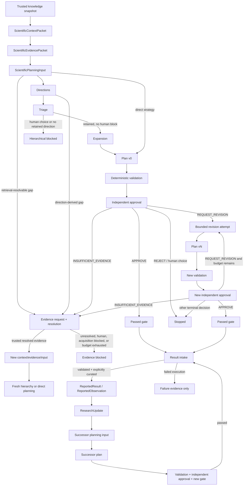

# Architecture and Scientific Trust Audit

Audit baseline: `3f565b2e2e7eb0ec4b8430c53b051a46e75eea94`.

Scope: hierarchical initial planning, bounded plan revision, planning-evidence
resolution, and provenance-bound result feedback/successor planning. This audit
does not establish scientific quality and does not add execution authority.

## Unified state graph

The loops share evidence, planning, validation, approval, and gate contracts;
they do not share approval outcomes. Every new plan version or successor plan
requires a new validation and independent approval chain.

## Authoritative artifacts and current projections

| Boundary | Immutable authority | Current/read convenience | Invalidation rule |
|---|---|---|---|
| Initial hierarchy | `hierarchical-planning/attempts/*.yaml`, `directions.yaml`, `triage.yaml`, `expansion.yaml` | top-level run status and candidate bindings | planning-input hash, prior-stage hash, provider identity/config, domain and snapshot bindings must match |
| Evidence resolution | `planning-evidence/policy.yaml`, `cycle-N/request-attempt.yaml`, request/resolution/cycle records and trigger archive | top-level `context.yaml`, `evidence-packet.yaml`, `planning-input.yaml` are the selected current projection | a child context creates `evidence-hierarchy-N/` and `evidence-replan-N/`; old artifacts remain audit history |
| Plan revision | immutable `round-N/` artifacts, attempt start/outcome records, and `plan-revisions/history/<hash>.yaml` | `plan-revisions/revision-chain.yaml` is the current pointer | parent plan, trigger review, input, provider config, candidate, receipt, validation and approval bindings are all checked |
| Result intake | immutable submission, archived raw bytes, assessment, curation and materialization receipt under `result-evidence/` | result status summary is derived | exact parent plan/task/capability, checksums, fingerprints and explicit curation are required |
| Successor planning | `cycle-N/invocation.yaml`, provider-call claim markers, parent binding, update, new context/input, plans, `selection.yaml`, and approval artifacts | `planning-outcome.yaml` records a human-selection wait; `cycle-N/cycle.yaml` is the completed authority | result/receipt pairs are canonically ordered; planning identity excludes candidate selection; only complete locally verified stage output permits resume |

Top-level workflow files are not independent authorities. Consumers must follow
their content-bound IDs/hashes and the owning chain/cycle records.

## Approval authority map

A plan is independently approved only when all rows below bind the same exact
plan version.

| Artifact | Required binding |
|---|---|
| `ScientificQuestionPlan` | authoritative plan ID, version and content hash |
| `PlanCompilationReceipt` | plan ID/hash, planning input/proposal lineage, grounded compiler origin |
| `PlanValidationRecord` | plan ID/version/hash, domain/version and reproducible validation result |
| `ApprovalReviewInput` | candidate, evidence/claim/capability allowlists and context; revision input also carries parent feedback/history |
| `ApprovalReviewRecord` | exact review-input ID/hash and provider identity |
| `ApprovalVerdict` | deterministic materialization of the review for the exact candidate |
| `IndependentApprovalReceipt` | review input, review, verdict, candidate and provider hashes |
| `ProjectTrustPolicy` | `independent_required` for these loops |
| `GateVerdict` | plan, validation, verdict, receipt, policy and compilation receipt; `passed=true` for downstream authority |

`validate_approved_plan_authority` is the common minimum validator used by
workflow approval reuse, revision history/trigger checks, and downstream result
parent validation. Export and downstream import retain additional
package/checksum/capability checks; those are intentionally stricter boundary
validators rather than alternative approval definitions.

## Budget isolation

| Budget/limit | Consumed by | Persisted as | Must not consume/reset |
|---|---|---|---|
| provider `max_attempts` | malformed structured outputs inside one provider operation | provider configuration/provenance | does not create scientific revision or evidence-cycle budget |
| hierarchy stage claim | starting directions, triage, or expansion for a bound input/provider | `HierarchicalPlanningStageAttempt` | resume reuses complete output; an uncertain stage is blocked, not called again |
| `max_evidence_resolution_cycles` | a claimed evidence request cycle, before provider inference | immutable `PlanningEvidenceCyclePolicy` plus request attempt/cycle records | plan revisions and provider retries do not reset it |
| `max_plan_revisions` | every started scientific revision attempt across base and every evidence-replan namespace | attempt start/outcome records; `revisions_used` remains the count of successful versions in the current chain | evidence resolution, hierarchy rerun and resume do not grant more attempts |
| successor invocation | one exact parent/canonical result set/follow-up/planning-provider configuration | `SuccessorPlanningInvocation` and planning call claim | CLI result order and later human candidate selection do not create another planning invocation |
| successor candidate selection | one exact invocation/proposal/candidate and explicit selection provenance | `SuccessorCandidateSelection` | cannot select a candidate from another proposal, invocation or changed hash; does not call the planner |

The revision count intentionally distinguishes started attempts from successful
versions. `PlanRevisionChain.revisions_used` keeps its existing public meaning;
budget enforcement uses the globally collected attempt records.

## Resume and crash boundaries

- Hierarchy: complete stages are validated and reused. A stage attempt without
  complete output is an uncertain terminal condition for ordinary resume.
- Evidence resolution: the attempt is saved before request generation. An
  attempt without a complete request set is not blindly repeated.
- Revision: an attempt start consumes budget before inference. Complete results
  are reused; missing outcomes are reconciled only when a fully bound revision
  record exists, otherwise the chain terminates as uncertain.
- Successor planning: the exact invocation is reserved before work. Planning
  and approval call claims are written before each external provider call.
  Complete proposal/candidate/receipt/validation artifacts resume at selection
  or approval without repeating planning. A complete approval authority chain
  can reconstruct a missing final cycle record. A claimed call without its
  complete stage output remains planning- or approval-specific uncertain state.
- Run locking prevents two local resumes from claiming the same operation.
  It is a local-filesystem lock, not a distributed exactly-once guarantee.

No code can prove an external model did or did not complete after a process or
network failure. The fail-closed response is an uncertain state, not an
automatic retry.

## Scientific trust boundary

| Input | What it is allowed to mean | What deterministic code must not infer |
|---|---|---|
| retrieval score/rationale | retrieval provenance and ranking rationale | scientific truth or source reliability |
| triage disposition/rationale | planning choice and audit explanation | independent scientific approval |
| approval criticism | review feedback bound to one plan | a new knowledge-base fact |
| executor convergence metadata | executor declaration retained for review | scientific validity or criterion satisfaction |
| curated numeric result | source-bound `ReportedResult` with method/system context | mechanism confirmation without independent interpretation/review |
| curated qualitative/null result | `ReportedObservation`, e.g. “not detected” | automatic hypothesis falsification |
| failed execution | failure provenance and missing-output gap | a scientific observation |
| executor interpretation | untrusted text retained outside authoritative claims | `SourceClaim`, fact, or accepted conclusion |

Materialization, retrieval, planning, triage, approval and execution success are
different states. No runnable task or execution authority is introduced here.

## Findings and fixes

### F-01 — Successor planning duplicated identical work (confirmed, fixed)

Before the fix, two calls with identical parent plan, accepted result,
follow-up and provider configuration produced two cycle IDs and invoked both
providers twice. The invocation is now content-bound and reserved once. A
completed cycle is reused; a started-but-incomplete provider operation is
blocked as uncertain.

Regression evidence: `test_same_successor_inputs_reuse_one_content_bound_cycle`
and `test_uncertain_successor_provider_call_is_not_repeated`. Completed-cycle
reuse also revalidates the parent binding, update, evidence packet, planning
input/proposal/candidates and approval authority; the tamper regression is
`test_completed_successor_cycle_is_not_reused_after_authority_tampering`.

### F-02 — approval validation drift allowed policy downgrade on resume (confirmed, fixed)

Before the fix, changing the stored trust policy to
`legacy_manual_allowed` still let `resume(..., approval_provider="none")`
return `APPROVED`. The shared authority validator now checks the complete plan,
validation, compilation, independent-review, policy and gate chain. The result
parent validator uses the same minimum boundary.

Regression evidence:
`test_resume_does_not_reuse_approval_after_trust_policy_tampering` and the
component-tampering matrix in `test_cross_loop_invariants.py`.

### F-03 — revised insufficient-evidence decisions bypassed evidence resolution; revision budget was namespace-local (partly reproduced, fixed)

A production workflow run reproduced the first behavior: a revision approval
with `INSUFFICIENT_EVIDENCE` returned `REJECTED` with zero evidence cycles. The
second risk was established from the active loader path rather than an observed
historical run: after evidence re-planning it inspected only the newest
namespace, so earlier started attempts were absent from the budget count.
Revision now runs before the shared insufficient-evidence branch, and attempts
are collected globally and required to have unique contiguous indices across
base and evidence-replan namespaces.

Regression evidence:
`test_evidence_replan_does_not_reset_global_revision_attempt_budget`.

### F-04 — successor result ordering changed invocation identity (confirmed, fixed)

Submission IDs/hashes and their materialization receipt IDs/hashes were stored
in CLI order. Reversing the same accepted set therefore created a second
invocation. The service now validates each submission/receipt/curation binding
first, then sorts the bound tuple as one unit and deterministically deduplicates
accepted evidence IDs. Duplicate, cross-plan and mismatched bindings still fail
closed.

Regression evidence:
`test_successor_result_set_order_has_one_canonical_invocation`.

### F-05 — planning identity conflated model planning and human selection (confirmed, fixed)

`selected_candidate_id` and approval-provider configuration previously changed
`SuccessorPlanningInvocation`, so selecting an already materialized candidate
could invoke the planner again. New invocation records bind only the parent,
canonical result set, follow-up request and planning provider/config. Explicit
selection is a separate immutable `SuccessorCandidateSelection` bound to the
exact invocation, proposal and candidate hash. Legacy invocation fields remain
readable but are not emitted for new invocations.

Planning decision is not human candidate selection. Triage/proposal generation
creates the candidate set; an explicit human selection chooses one immutable
candidate for independent approval. Neither operation is itself scientific
approval.

Regression evidence:
`test_human_candidate_selection_reuses_the_original_planning_output` and
`test_candidate_from_another_successor_invocation_is_rejected`.

### F-06 — successor resume collapsed distinct crash stages (confirmed, fixed)

The previous implementation treated any call marker without `cycle.yaml` as a
planning uncertainty, even when all planning or approval artifacts were already
durably stored. Resume now validates each stage independently. It reuses a
complete planning output, reconstructs a final cycle from a complete approval
authority chain, and refuses to repeat a provider only when that provider's
claimed outcome is incomplete or unverifiable. This is local reconciliation,
not an exactly-once guarantee for remote inference.

Regression evidence:
`test_complete_planning_output_resumes_at_approval_without_replanning`,
`test_approval_claim_without_complete_output_is_not_repeated`, and
`test_complete_approval_output_rebuilds_cycle_without_provider_calls`.

### F-07 — successor status inferred paths from lexical order/count (confirmed, fixed)

Status now parses canonical numeric `cycle-N` indexes, reports latest complete
and latest attempted indexes separately, retains intermediate incomplete states,
and loads the parent binding from the actual indexed directory. Non-canonical or
symlinked cycle directories fail closed.

Regression evidence:
`test_successor_status_uses_numeric_indexes_and_reports_incomplete_cycles`.

### F-08 — stored successor selection was skipped on resume (confirmed, fixed)

After a human candidate selection was saved, a resume without repeating the
candidate ID could return to the human-choice outcome. Resume now validates the
stored selection against the exact invocation, proposal, and candidate hash
before deciding whether human input is still needed. A different explicit
candidate conflicts with the immutable selection; an existing approval claim
continues through approval-stage recovery.

Regression evidence: stored selection resume before approval, interrupted
approval recovery, and conflicting candidate selection tests in
`tests/test_cross_loop_invariants.py`.

### F-09 — evidence-trigger archive did not apply the shared trust policy (confirmed, fixed)

Trigger archive checks now call `validate_approved_plan_authority` with
`require_passed=False`, because an `INSUFFICIENT_EVIDENCE` review can trigger
retrieval without approving the plan for export. Request-set, candidate, and
trigger bindings remain additional checks. A test downgrades the archived
policy and updates the gate hash to match; the archive still fails because the
required independent approval mode is enforced.

Regression evidence: `test_evidence_trigger_archive_rejects_self_consistent_manual_policy_downgrade`.

### F-10 — successor cycle directory could disagree with its lineage index (confirmed, fixed)

Cycle inventory and status loading now require each stored
`SuccessorParentBinding.successor_cycle_index` to match its numeric directory
name. Completed cycles must also bind the parent-binding artifact in that
directory. Status takes `parent_plan` from the latest attempted cycle binding,
with result submissions used only when no cycle binding exists.

Regression evidence: numeric cycle ordering with an incomplete gap, latest
attempted parent-plan reporting, and complete/incomplete path-index mismatch
tests in `tests/test_cross_loop_invariants.py`.

## Deliberately retained duplication

- `validate_approved_plan_authority` covers the shared minimum authority chain.
- export validation additionally verifies staged files, checksums and exact
  selected plan;
- downstream import additionally verifies package and capability bindings;
- evidence-trigger archives additionally bind the trigger review/candidate to
  the evidence request;
- result intake additionally validates task, capability, artifact bytes and
  system/method fingerprint compatibility.

Merging those into one universal validator would hide boundary-specific
requirements and was therefore not done.

## Deferred risks and non-goals

1. There is no automatic reconciliation or “force retry” command for an
   uncertain successor provider call. Manual inspection/new explicit intent is
   required; adding that policy is outside this audit.
2. Local directory locking does not provide distributed process coordination.
3. Legacy histories that already contain duplicate revision-attempt indices
   across namespaces now fail closed; this audit does not rewrite history.
4. Current projection files remain mutable derived views. Immutable
   round/cycle/history artifacts are the authority.
5. The tests establish orchestration, binding, resume and truth-boundary
   behavior with offline providers. They do not show that a plan, review, or
   result is scientifically correct.

## Cross-loop regression matrix

`tests/test_cross_loop_invariants.py` covers:

1. hierarchy to bounded revision without reopening hierarchy;
2. insufficient evidence to a fresh hierarchy and fresh approval;
3. global revision budget across evidence re-planning;
4. human-choice hierarchy blocking across resume;
5. canonical successor result-set invocation idempotency and separate human selection;
6. stage-aware successor recovery and uncertain provider-call non-repetition;
7. policy, gate, validation, compilation and review tampering;
8. qualitative negative observation preservation without claim promotion;
9. failed execution producing no scientific result/observation;
10. exact parent/result/successor bindings and numeric cycle status through production services.

The owning suites continue to cover multi-round feedback carry-forward,
evidence-cycle exhaustion, concurrent revision resume, two-generation successor
lineage, exact fingerprint deviation matching, export selection and
`runnable=false`.
